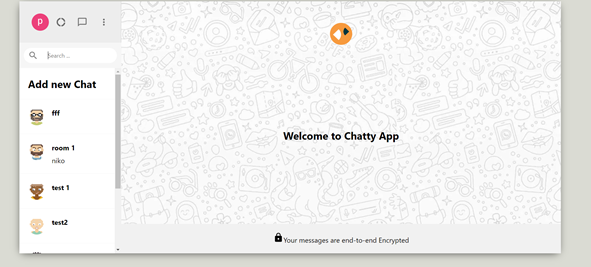

# Chatty-App

Chatty-App is a real-time chat application built using React, Firebase Authentication, and Firebase Firestore. This application allows users to sign in securely, join chat rooms, and engage in real-time conversations with other users.

## Preview


## Table of Contents

- [Chatty-App](#chatty-app)
  - [Preview](#preview)
  - [Table of Contents](#table-of-contents)
  - [Features](#features)
  - [Installation](#installation)
  - [Usage](#usage)
  - [Firebase Configuration](#firebase-configuration)
  - [Context API](#context-api)

## Features

- **User Authentication:** Secure user authentication powered by Firebase Authentication.
- **Real-time Chat:** Users can join chat rooms and send/receive real-time messages.
- **Firebase Firestore:** Utilizes Firebase Firestore for data storage and real-time updates.
- **Context API:** Manages application state and user data using React's Context API.

## Installation

1. Clone the repository:

    ```bash
    git clone https://github.com/preston176/chatty-chat-react.git
    ```

2. Change into the project directory:

    ```bash
    cd chatty-chat-react
    ```

3. Install dependencies:

    ```bash
    npm install
    ```

## Usage

1. Start the development server:

    ```bash
    npm start
    ```

2. Open your web browser and navigate to [http://localhost:3000](http://localhost:3000) to use the application.

## Firebase Configuration

Before running the application, you need to set up Firebase for authentication and Firestore:

1. Create a Firebase project on the [Firebase Console](https://console.firebase.google.com/).

2. Configure Firebase Authentication and Firestore in your Firebase project.

3. Obtain the Firebase configuration object (apiKey, authDomain, projectId, etc.) from your Firebase project settings.

4. Create a file named `.env.local` in the project root and add your Firebase configuration as environment variables:

    ```env
    REACT_APP_FIREBASE_API_KEY=your_api_key
    REACT_APP_FIREBASE_AUTH_DOMAIN=your_auth_domain
    REACT_APP_FIREBASE_PROJECT_ID=your_project_id
    ```

## Context API

The application utilizes React's Context API for state management. The `UserContext` provides user authentication state, while the `ChatContext` manages chat-related state. To access these contexts in your components:
